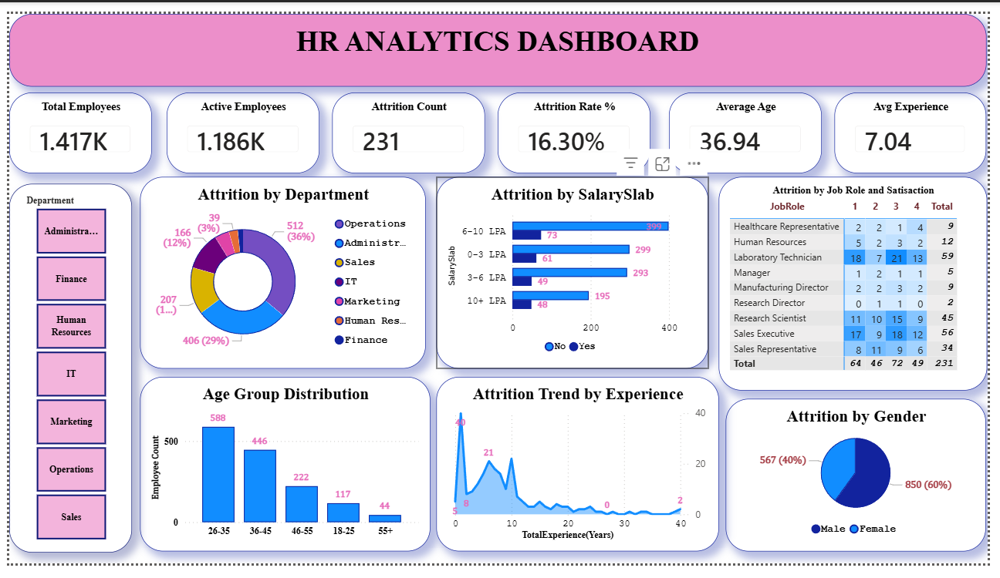

# HR---Analytics---Dashboard
HR Analytics Dashboard built using Microsoft Power BI to analyze employee attrition, salary distribution, department performance, age groups, and workforce trends. Includes interactive visualizations, KPI cards, and filters to help organizations make data-driven HR decisions.

## Project Overview
This project is an interactive HR Analytics Dashboard built using Power BI to analyze employee attrition, salary distribution, department performance, and workforce demographics.

## Tools Used
- Power BI
- Excel
- DAX
- Data Visualization

## Key Insights
- Total Employees: 1470+
- Attrition Rate: 16.3%
- Highest Attrition in Sales Department
- Age Group 26–35 has highest employee count

## Features
- Interactive Filters
- Department-wise Analysis
- Salary Slab Analysis
- Gender-based Attrition
- Experience Trend Analysis

## Dashboard Preview

## Author
BhagyaRaj
